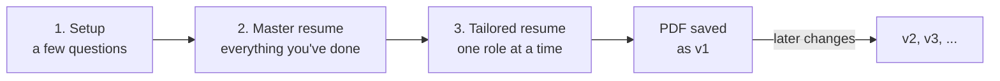

# Resume Studio

**Write your career down once. Get a tailored, page-perfect PDF resume for every application after that.**

Resume Studio is a set of skills for AI coding agents ([Cursor](https://cursor.com) or [Claude Code](https://claude.com/claude-code)). You talk; it asks the right questions, keeps one complete record of your career, and turns it into one-page or two-page LaTeX resumes tailored to each role. Every resume you settle on is saved as v1, v2, and so on, so nothing you've sent is ever lost.

Most AI resume tools take your resume plus a job description and hand back a rewrite. They don't know you contributed to a system rather than owned it, or that the impressive number came from a prototype that never shipped. They'll quietly upgrade "contributed to" into "built," and you won't notice until an interviewer asks a follow-up question. Resume Studio tracks what you actually did, and won't let a resume claim more.

**Contents:** [How it works](#how-it-works) · [Before you start](#before-you-start) · [Getting started](#getting-started) · [What gets created](#what-gets-created-on-your-machine) · [Things you can say](#things-you-can-say) · [Versions](#versions) · [Live preview](#live-preview) · [FAQ](#faq) · [Installing LaTeX](#installing-latex) · [Skills](#skills-reference)

---

## How It Works



It keeps two kinds of document with opposite jobs:

| | Master resume | Tailored resume |
|---|---|---|
| What it is | Everything you've done, in full detail | One role's resume |
| Length | No limit. 4, 8, 20 pages. | 1 or 2 pages, fitted exactly |
| Format | Markdown | Markdown draft, then a LaTeX PDF |
| Sent to employers? | Never | Yes, as a saved version |

You build the master once and add to it over time. Every tailored resume is selected from it, so no application starts from whatever you happen to remember that day.

---

## Before You Start

**You need:**

- **Cursor or Claude Code.** The agent does the work; you answer questions.
- **Python 3.** Already installed on macOS and most Linux systems. Used for the live preview and the length checker.
- **LaTeX, but only for the final PDF.** You don't need it to start. When you reach the PDF step, the agent installs it for you, with no admin password on macOS. Manual steps are in [Installing LaTeX](#installing-latex).

**Have these handy if you can** (none are required):

- Your existing resume or resumes: `.docx`, `.pdf`, `.md`, or a Google Docs link
- Anything else that describes your work: a LinkedIn export, performance reviews, project notes
- Links to the job descriptions you're aiming for

Built and tested on macOS. Linux works the same way. On Windows, use WSL.

---

## Getting Started

### Step 1: Get Resume Studio

```bash
git clone https://github.com/Amruth-Ashok/resume-studio.git
```

Or click **Code → Download ZIP** on GitHub and unzip it.

### Step 2: Open the folder

- **Cursor:** File → Open Folder → choose `resume-studio`.
- **Claude Code:** `cd resume-studio && claude`

### Step 3: Start a chat

Type:

> Help me with my resume

That's the only thing you need to remember. The agent reads `AGENTS.md` (or `CLAUDE.md` in Claude Code), finds the skills, and starts the setup. If you installed Resume Studio as a plugin, `/resume-start` does the same thing.

### Step 4: Answer the setup questions

About five minutes, one topic at a time:

1. Your name and contact details
2. What you already have: a master resume, role-specific resumes, other documents, or nothing at all
3. What you're aiming for: each role or program, the company, the job-description link, one page or two
4. A couple of defaults
5. Anything that must never be overstated, like a customer under NDA or a prototype that never shipped

When it asks for your documents, put them in `sources/originals/`. It creates that folder for you. Your files stay in this folder on your machine.

### Step 5: Build your master resume

This is the longest step, and the one that makes everything after it good. The agent reads your documents and merges them into `sources/master-resume.md`. Then it goes through the master **one job and one achievement at a time**, asking about what your old resumes compressed away: what you owned versus helped with, the real numbers, what shipped and what didn't.

It's a conversation, not a form, so spread it over as many sessions as you like. Stop whenever you want: the file records exactly where you stopped, and saying *"where was I?"* in a new chat picks it back up. You only do this once; later, you just add new work.

### Step 6: Make your first tailored resume

One target at a time:

1. **Plan.** It proposes which achievements to use and why, shows which job requirements they cover, and names any gaps. You approve or change the selection.
2. **Draft.** It writes the whole resume in markdown, and you go back and forth until it reads right. Keep the [live preview](#live-preview) open to watch it change.
3. **Render.** It turns the draft into LaTeX and compiles a PDF that fits the page exactly, and tells you if anything had to be reworded to fit.
4. **Save.** When you say it's good, it's saved as **v1**.

Your PDF is at `targets/<target-name>/versions/v1/resume.pdf`.

### Step 7: Keep going

- **Next role:** *"Let's do the next target."*
- **Improve one:** ask for changes. When you're happy, it becomes v2, and v1 stays as it was.
- **Get feedback:** *"Review my resume"* for a scored critique with ranked fixes. Works best in a fresh chat.
- **Cover letter:** *"Write a cover letter for this one."*
- **New job or project later:** *"Add my new role to the master."*

---

## What Gets Created on Your Machine

The GitHub repository contains only the tool. Your own folders don't exist until setup creates them, right here inside `resume-studio/`:

```
resume-studio/
├── skills/, references/, ...      the tool itself (from GitHub)
├── resume-config.md               your contact details and preferences
├── sources/
│   ├── master-resume.md           your complete career record
│   └── originals/                 the resumes and documents you started from
└── targets/
    └── acme-ml-engineer/          one folder per role you're targeting
        ├── brief.md               what it's for, decisions, version history
        ├── jd.md                  the job description text
        ├── draft.md               the working copy
        ├── resume.pdf             the latest build
        └── versions/
            ├── v1/                frozen: draft, LaTeX, PDF
            └── v2/
```

All of your files are listed in `.gitignore`, which means:

- they never show up in `git status`, so your resume can't be committed or pushed by accident
- `git pull` updates the tool without touching them
- if you want them backed up with git, use a **private** fork and delete the lines under "Personal resume data" in `.gitignore`

---

## Things You Can Say

You don't need to remember any skill names. Plain requests work:

| You want to | Say something like |
|---|---|
| Start, or find out where you left off | *"Help me with my resume"* or *"Where was I?"* |
| Go deeper on your master | *"Let's go through my master resume"* |
| Add new work | *"I got promoted"* or *"Add my new project"* |
| Target a role | *"Make a resume for this job: [link]"* |
| See it laid out | *"Show me the preview"* |
| Get the PDF | *"Render it"* |
| Freeze a version | *"This one's good, save it"* |
| Compare versions | *"What changed between v1 and v2?"* |
| Go back | *"Go back to v1 and start from there"* |
| Track applications | *"I sent v2 to Acme"* |
| Get a critique | *"Review this resume"* |
| Get a cover letter | *"Write a cover letter for this one"* |

---

## Versions

Each target keeps a numbered history. `draft.md` is always the working copy. When you say a resume is settled, the draft, its LaTeX, and its PDF are frozen into `versions/v1/`, and every later change becomes v2, v3, and so on. Each version records the date, what changed since the previous one, which master it was built from, and, if you tell it, where you sent it.

Saved versions are never edited. Going back to v1 doesn't delete v2; your next save simply becomes v3. The file to send is always the newest `targets/<target-name>/versions/vN/resume.pdf`.

---

## Live Preview

```bash
python3 scripts/preview.py
```

Opens `http://localhost:8000` with every draft rendered in resume styling. A4 page boundaries show exactly where a page break falls, and every bullet is colour-coded against its length budget, with the exact count on hover. Edits show up within a second. Saved versions are in the dropdown too, for comparing against the current draft. No LaTeX needed.

---

## FAQ

**The `/resume-start` command doesn't show up.**
Slash commands only appear when Resume Studio is installed as a plugin. In a plain clone, just say *"help me with my resume"*; `AGENTS.md` and `CLAUDE.md` point the agent at the skills.

**It says LaTeX or `pdflatex` isn't installed.**
Let the agent install it when it offers, or follow [Installing LaTeX](#installing-latex). Everything before the PDF step works without it.

**My old resume is a Google Doc.**
Share the link during setup. If the agent can't open it, use File → Download → Microsoft Word (.docx) in Google Docs and put the file in `sources/originals/`.

**Can I stop halfway through?**
Yes, at any point. Progress is saved in your files, not in the chat. Open a new chat and say *"where was I?"*

**Will updating Resume Studio overwrite my resumes?**
No. Your files are gitignored, so `git pull` only updates the tool.

**Which file do I send to employers?**
The `resume.pdf` in the newest `versions/vN/` folder of that target. Ask *"which version is the latest?"* if unsure.

**Does my data leave my computer?**
Your files stay in this folder. The only thing that leaves your machine is what your AI agent sends to its model provider during the chat, as with any AI chat.

**Can I keep my resume files somewhere else?**
Yes. See [Keeping your data in a separate folder](#keeping-your-data-in-a-separate-folder).

---

## Installing LaTeX

You only need this for the PDF step, and the agent can do it for you. To do it yourself:

**macOS** (TinyTeX, no admin password):

```bash
curl -fsSL https://github.com/rstudio/tinytex-releases/releases/download/daily/TinyTeX-1-darwin.tar.xz | tar -xJ -C ~/Library
echo 'export PATH="$HOME/Library/TinyTeX/bin/universal-darwin:$PATH"' >> ~/.zshrc && source ~/.zshrc
tlmgr install lastpage parskip enumitem fontawesome pgf fancyhdr moderncv fontawesome6 multirow colortbl ragged2e microtype babel-english lm
```

**Linux** (TinyTeX, no sudo):

```bash
curl -sL "https://yihui.org/tinytex/install-bin-unix.sh" | sh
tlmgr install lastpage parskip enumitem fontawesome pgf fancyhdr moderncv fontawesome6 multirow colortbl ragged2e microtype babel-english lm
```

Open a new terminal afterwards if `tlmgr` isn't found.

**Already have MacTeX, BasicTeX, or TeX Live?** Run just the `tlmgr install` line, with `sudo` if your distribution is system-wide.

---

## Keeping Your Data in a Separate Folder

Prefer the tool and your resume in different places? Install Resume Studio as a plugin, then start a chat in any folder:

- **Cursor:** open Customize, add a plugin **From GitHub Repository**, enter `Amruth-Ashok/resume-studio`, and install it.
- **Claude Code:**
  ```
  /plugin marketplace add Amruth-Ashok/resume-studio
  /plugin install resume-studio@resume-studio
  ```

Or keep a clone anywhere and put an `AGENTS.md` in your data folder that points at it:

```markdown
This folder holds my resume data for Resume Studio. The plugin is at ../resume-studio.
Read ../resume-studio/AGENTS.md and follow it. Skills are in ../resume-studio/skills/.
```

---

## Skills Reference

| Skill | What it does |
|-------|-------------|
| `resume-start` | Setup Q&A for new users, "where you left off" for returning ones |
| `master-resume` | Builds the master from documents or by interview, deep dives it, appends new work |
| `resume-target` | Selects achievements and drafts a tailored resume in markdown, iterating with you |
| `resume-preview` | Live localhost render with page breaks and per-bullet length colours |
| `resume-render` | Fits the confirmed draft to the page, compiles the PDF |
| `resume-version` | Saves settled resumes as v1, v2, ..., compares them, restores old ones |
| `resume-review` | Five-perspective critique, seven-dimension score, ranked fixes |
| `cover-letter` | One-page letter that complements the resume rather than repeating it |

Works for job applications, internal transfers, grad school (Master's and PhD), and fellowships. The target type changes what gets emphasized: an admissions committee cares about trajectory and research fit, a hiring manager cares about shipped impact.

---

## Why the Resumes Are Better

**Ownership is tracked, not guessed.** Every achievement in the master carries a `scope:` tag: sole owner, tech lead, contributor. The verb on the generated bullet has to match. A `contributor` achievement can't become "Built."

**The numbers fit.** A two-line bullet in this template holds 189 to 205 rendered characters, and its second line has to reach 78 or it looks ragged. Bold text costs extra width. `scripts/char_count.py` enforces all of it before anything compiles.

**The theme line does the tailoring.** Above each job sits a bold line that isn't your title, with the real title underneath in italics. The same role reads as "Distributed Systems & Platform Reliability" for one application and "Customer-Facing Data Solutions" for another. Both true, and it's the first thing a reader's eye lands on.

**It doesn't sound generated.** Banned word lists, a rule against bullets ending in `-ing` phrases, an em-dash cap, and a twelve-item scan before anything is presented.

**Detail that won't fit still gets captured.** The master records what was hard about each project and who else was involved. That never reaches the resume, but it's what makes a cover letter specific and what you'll actually say in the interview.

---

## Customizing

- **Visual style** lives in `assets/templates/resume.cls`. Change fonts, spacing, colors there.
- **Character budgets** live in `references/latex-budgets.md`. If you change the font size or margins, recalibrate them or the fitting logic will be wrong.
- **Writing rules** live in `references/bullet-craft.md` and `references/ai-fingerprint.md`.
- **Scoring weights** live in `references/review-rubric.md`.
- **Workspace and versioning rules** live in `references/workspace.md`.

---

## Credits

Derived from [claude-resume-kit](https://github.com/ARPeeketi/claude-resume-kit) by ARPeeketi (MIT), with the academic and publication machinery removed, the extraction layer generalized, and the master-resume-as-source-of-truth model added. The LaTeX class descends from a template by Trey Hunner via LaTeXTemplates.com.

MIT licensed. See [LICENSE](LICENSE).
